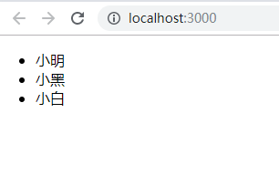

# react条件渲染

React中条件渲染即和JavaScript中一样，条件运算，如if..else...,三元运算符等。

## 1. 条件渲染

### 1.1 简单的条件渲染

```js
function UserGreet(props) {
  return (
    <h1>你好</h1>
  )
}

function UserLogin(props) {
  return (
    <h1>请先登录</h1>
  )
}

class LoginComponent extends React.Component {
  constructor(props) {
    super(props)
    this.state = {
      isLogin: false
    }
  }

  // 直接根据条件返回对应的JSX对象
  render() {
    if (this.state.isLogin) {
      return (<UserGreet />)
    } else {
      return (<UserLogin />)
    }
  }
}
```

### 1.2 使用插槽

```js
// 直接根据条件返回对应的JSX对象
  render() {
    let element = null
    if (this.state.isLogin) {
      element = <UserGreet />
    } else {
      element = (<UserLogin />) // 括号可要可不要
    }

    return (
      <div>
        <p>这是头部</p>
        {element}
        <p>这是尾部</p>
      </div>
    )
  }
```

### 1.3 使用三目运算符

```js
render() {
  return (
    <div>
      <p>这是头部</p>
      { this.state.isLogin ? <UserGreet /> : <UserLogin /> }
      <p>这是尾部</p>
    </div>
  )
}
```

## 2. 列表渲染

### 2.1 demo1

```js
let arr = ['小明', '小黑', '小白']

class LoginComponent extends React.Component {
  constructor(props) {
    super(props)
    this.state = {
      isLogin: false
    }
  }

  // 这里arr会直接渲染成字符串
  render() {
    return (
      <div>
        <ul>
          {arr}
        </ul>
      </div>
    )
  }
}
```

渲染出来结果如下：


### 2.2 demo2

要想渲染列表，需要在数组中使用JSX对象

```js
let arrList = [<li>小明</li>, <li>小黑</li>, <li>小白</li>]

class LoginComponent extends React.Component {
  constructor(props) {
    super(props)
    this.state = {
      isLogin: false
    }
  }

  // 这里arr会直接渲染成字符串
  render() {
    return (
      <div>
        <ul>
          {arrList}
        </ul>
      </div>
    )
  }
}
```

渲染出来结果如下：

